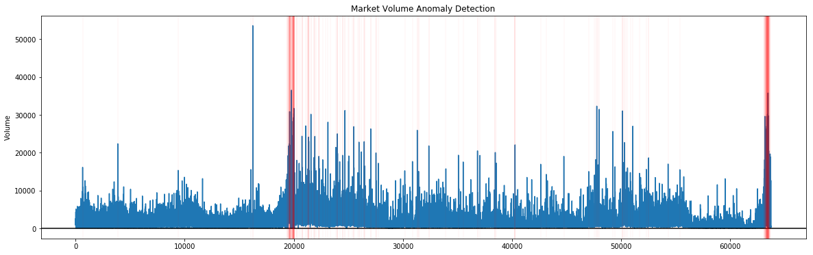

## Algorithmic Trading

This project uses the isolation forest to find anomalies in the hourly volume of Eur/Usd.

## IPython Notebooks:

- [Envelope Strategy](https://nbviewer.jupyter.org/github/vorsatti/Anomalies-Detection/blob/master/Anomaly%20Detection.ipynb)

#### Conclusion:

Here we can see where the detected anomalies are:

